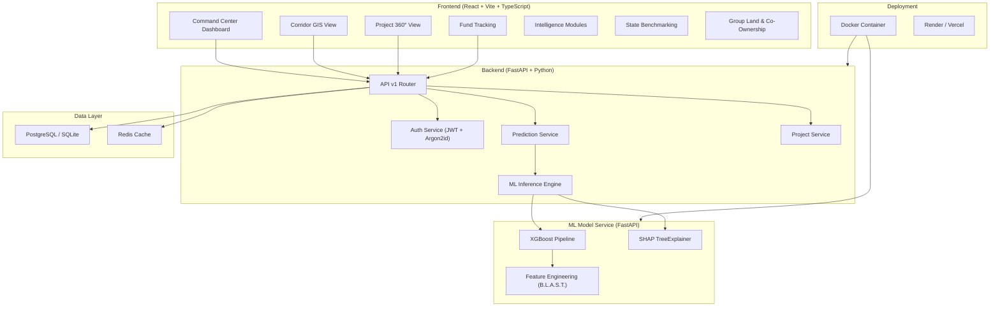
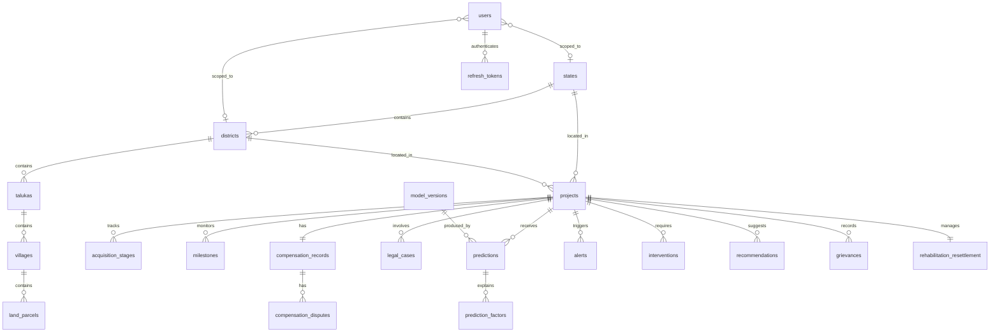
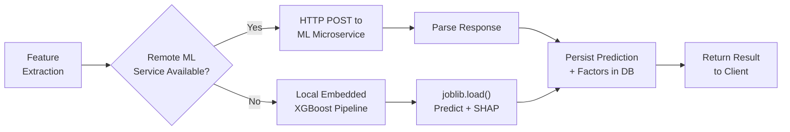

# BhoomiSetu — Land Acquisition Early Warning & Decision Intelligence Platform

> **Smart India Hackathon 2026** | AI-Powered Pre-Disruption Risk Predictor & Explainability Engine

---

## 1. Executive Summary

**BhoomiSetu** is a full-stack, AI-powered decision intelligence platform built for the **Smart India Hackathon 2026**. It predicts land acquisition delays (>90 days) for Indian government infrastructure projects using machine learning, and provides real-time explainability through SHAP (SHapley Additive exPlanations) factor attribution.

The platform targets government administrators, district collectors, and ministry officials, enabling proactive identification of at-risk infrastructure projects before delays cascade into multi-crore cost overruns.

### Key Capabilities

| Capability | Description |
|---|---|
| 🧠 **ML Early Warning** | XGBoost classifier (500 trees) predicting >90 day land acquisition delay probability |
| 🔍 **SHAP Explainability** | Non-causal SHAP TreeExplainer reveals top risk-driving features per project |
| 🗺️ **GIS Corridor Mapping** | PostGIS-backed spatial conflict detection with LineString corridor alignments |
| ⚖️ **Statutory Tracking** | RFCTLARR Act Section 4, 11, 19, 23 milestone and SLA breach tracking |
| 💰 **Fund Tracking** | Sanctioned vs Released vs Disbursed compensation with 30/60/90-day aging buckets |
| 🧪 **What-If Simulation** | In-memory counterfactual parameter testing without database writes |
| 🛡️ **Enterprise Security** | Argon2id hashing, JWT with rotation, RBAC, BOLA/IDOR prevention, geo-scoping |
| 📊 **State Benchmarking** | Cross-district and cross-state comparative analytics |

---

## 2. Architecture Overview



---

## 3. Project Structure

```
Hackathon/
├── app.py                          # ML Model REST API (FastAPI) — standalone service
├── train_and_export.py             # XGBoost model training & serialization script
├── streamlit_app.py                # Streamlit Cloud inference dashboard
├── key_manager.py                  # API key generation, validation & rotation CLI
├── test_api.py                     # Automated test suite for ML API
├── run_server.py                   # Uvicorn server launcher
├── requirements.txt                # ML service Python dependencies
├── Dockerfile                      # Docker image for ML API
├── Procfile                        # Render/Heroku process file
├── render.yaml                     # Render deployment config
├── vercel.json                     # Vercel deployment config
├── land_acquisition_master.csv     # Training dataset (~10MB, multi-snapshot)
├── api_keys.json                   # Persistent API key store
├── bhoomi_setu.db                  # SQLite database (runtime)
│
├── models/                         # Serialized ML artifacts
│   ├── bhoomi_xgb_pipeline.joblib  # Trained XGBoost sklearn Pipeline
│   ├── bhoomi_shap_explainer.joblib # SHAP TreeExplainer
│   ├── model_metadata.json         # Feature lists, metrics, risk tiers
│   └── sample_projects.json        # Preset test cases per risk tier
│
├── static/
│   └── index.html                  # Static dashboard page
│
├── docs/
│   └── SECURITY.md                 # Security documentation
│
└── updated_final_frotned/          # Full-stack production application
    ├── frontend/                   # React + Vite + TypeScript SPA
    │   ├── src/
    │   │   ├── App.tsx             # Root component with routing & AppShell
    │   │   ├── main.tsx            # Entry point
    │   │   ├── components/         # Feature views
    │   │   │   ├── corridor-gis-view.tsx          # National corridor map
    │   │   │   ├── project-360-view.tsx            # Single-project deep-dive
    │   │   │   ├── fund-tracking-view.tsx          # Financial analytics
    │   │   │   ├── group-land-view.tsx             # Co-ownership management
    │   │   │   ├── intelligence-modules-view.tsx   # AI intelligence center
    │   │   │   ├── state-benchmarking-view.tsx     # Cross-state analytics
    │   │   │   ├── login-page.tsx                  # Authentication UI
    │   │   │   ├── error-boundary.tsx              # Error handling
    │   │   │   ├── project-indicator-matrix-modal.tsx
    │   │   │   └── ui/                             # Radix UI primitives
    │   │   ├── lib/                # API client, mock data, sync service
    │   │   ├── hooks/              # Custom React hooks
    │   │   ├── context/            # React context providers
    │   │   ├── types/              # TypeScript type definitions
    │   │   └── styles/             # CSS stylesheets
    │   ├── package.json
    │   ├── vite.config.ts
    │   └── tsconfig.json
    │
    └── backend/                    # Production FastAPI backend
        ├── app/
        │   ├── main.py             # FastAPI app factory with lifespan management
        │   ├── api/v1/             # Versioned API routes
        │   │   ├── router.py       # Central router (16 sub-routers)
        │   │   ├── auth.py         # JWT authentication endpoints
        │   │   ├── projects.py     # Project CRUD
        │   │   ├── predictions.py  # ML prediction endpoints
        │   │   ├── simulation.py   # What-If scenario simulation
        │   │   ├── dashboard.py    # Dashboard aggregation API
        │   │   ├── compensation.py # Compensation tracking
        │   │   ├── legal.py        # Legal case management
        │   │   ├── map.py          # GIS & spatial endpoints
        │   │   ├── alerts.py       # Risk alert management
        │   │   ├── audit.py        # Audit trail
        │   │   ├── ingest.py       # Data ingestion pipeline
        │   │   ├── rr.py           # Rehabilitation & Resettlement
        │   │   ├── row.py          # Right-of-Way tracking
        │   │   ├── stakeholders.py # Stakeholder management
        │   │   ├── recommendations.py # AI recommendations
        │   │   └── group_land.py   # Group land co-ownership
        │   ├── core/
        │   │   ├── config.py       # Pydantic Settings (env-driven)
        │   │   ├── security.py     # Argon2id + JWT + token rotation
        │   │   ├── dependencies.py # Auth guards & geo-scoping
        │   │   ├── exceptions.py   # Domain exception hierarchy
        │   │   └── logging.py      # Structured logging
        │   ├── db/
        │   │   ├── session.py      # AsyncSession engine factory
        │   │   └── base.py         # SQLAlchemy Base + mixins
        │   ├── models/             # SQLAlchemy ORM models (13 tables)
        │   │   ├── projects.py     # Project, AcquisitionStage, Milestone, Corridor
        │   │   ├── users.py        # User, RoleEnum, RefreshToken
        │   │   ├── geography.py    # State, District, Taluka, Village, LandParcel
        │   │   ├── compensation.py # CompensationRecord, CompensationDispute
        │   │   ├── legal.py        # LegalCase
        │   │   ├── social.py       # RehabilitationResettlement, Grievance
        │   │   ├── predictions.py  # ModelVersion, Prediction, PredictionFactor
        │   │   ├── decisions.py    # Recommendation, Intervention, Alert
        │   │   ├── audit.py        # AuditLog
        │   │   └── group_land.py   # GroupLandParcel, ParcelCoOwner, ShareSaleRequest
        │   ├── inference/          # ML inference engine
        │   │   ├── predictor.py    # Prediction orchestrator (remote + local fallback)
        │   │   ├── feature_adapter.py  # ORM-to-feature-vector transformation
        │   │   ├── model_provider.py   # Singleton model loader
        │   │   └── ml_model_bridge.py  # External ML service bridge
        │   ├── services/           # Business logic layer
        │   │   ├── prediction_service.py # Prediction + SHAP persistence
        │   │   ├── project_service.py    # Project lifecycle management
        │   │   └── auth_service.py       # Authentication & token management
        │   ├── schemas/            # Pydantic request/response schemas
        │   ├── repositories/       # Data access layer
        │   ├── recommendations/    # AI recommendation engine
        │   ├── tasks/              # Background task handlers
        │   └── tests/              # pytest test suite
        ├── migrations/             # Alembic database migrations
        ├── data/                   # Seed data & fixtures
        ├── supabase_schema.sql     # Production PostgreSQL schema (545 lines)
        ├── supabase_seed.sql       # Seed data for development
        ├── docker-compose.yml      # Multi-service Docker orchestration
        ├── requirements.txt        # Backend Python dependencies
        └── README.md               # Backend-specific documentation
```

---

## 4. Machine Learning Model

### 4.1 Algorithm & Training Pipeline

| Parameter | Value |
|---|---|
| **Algorithm** | XGBClassifier (Extreme Gradient Boosting) |
| **Estimators** | 500 trees |
| **Max Depth** | 6 |
| **Learning Rate** | 0.03 |
| **Tree Method** | `hist` (histogram-based) |
| **Regularization** | L1 (α=0.1), L2 (λ=1.0) |
| **Subsample** | 0.8 (row), 0.8 (column) |
| **Target** | Binary — `delayed_gt_90_days` (1 = delay > 90 days) |
| **Train/Test Split** | GroupShuffleSplit by `project_id` (zero data leakage) |
| **Split Ratio** | 60% Train / 20% Validation / 20% Test |

### 4.2 Model Performance Metrics

| Metric | Score |
|---|---|
| **Accuracy** | 91.37% |
| **ROC-AUC** | 0.9741 |
| **Precision** | High (see validation) |
| **Recall** | High (see validation) |
| **F1-Score** | Balanced |
| **PR-AUC** | Available in metadata |

### 4.3 B.L.A.S.T. Feature Engineering Framework

The model uses a proprietary **B.L.A.S.T.** domain feature engineering framework encompassing 5 risk dimensions:

#### **B — Budget & Financial Ratios**
| Feature | Formula |
|---|---|
| `cost_per_hectare` | `project_cost / land_required_hectares` |
| `cost_per_km` | `project_cost / project_length_km` |
| `compensation_to_cost_ratio` | `compensation_awarded / project_cost` |
| `compensation_disbursement_rate` | `compensation_paid / compensation_awarded` |
| `pending_comp_to_cost` | `compensation_pending / project_cost` |

#### **L — Legal & Dispute Density**
| Feature | Formula |
|---|---|
| `total_litigation_cases` | `legal + court + arbitration + ownership disputes` |
| `litigation_per_family` | `(legal + court cases) / affected_families` |
| `litigation_per_km` | `total_litigation / project_length_km` |
| `public_friction_index` | `(objections + grievances + rr_grievances) / families` |

#### **A — Acquisition Velocity**
| Feature | Formula |
|---|---|
| `land_acquisition_rate` | `land_acquired_pct / days_since_notification` |
| `rr_velocity` | `rr_completion_pct / days_since_notification` |

#### **S — Stagnation & Administrative Lag**
| Feature | Formula |
|---|---|
| `stage_stagnation_ratio` | `days_in_current_stage / days_since_notification` |
| `administrative_lag_share` | `(notification + approval + survey delays) / total days` |

#### **T — Temporal & Interaction Terms**
| Feature | Formula |
|---|---|
| `delta_land_acquired_pct` | Longitudinal change in land acquisition (grouped by project) |
| `stakeholder_friction_x_comp_pending` | `(100 - stakeholder_response_rate) × compensation_pending_pct / 100` |
| `possession_deficit` | `land_acquired_pct - possession_pct` |

**Total Features**: 42 base + 16 engineered = **58 input features** (expanded to 100+ after one-hot encoding of categoricals)

### 4.4 Risk Tier Classification

| Tier | Probability Range | Color | Recommended Action |
|---|---|---|---|
| 🟢 **LOW** | < 40% | `#10b981` | Normal operational track. Standard milestone monitoring. |
| 🟡 **MODERATE** | 40% – 59% | `#f59e0b` | Early warnings detected. Monthly inter-departmental review. |
| 🟠 **HIGH** | 60% – 79% | `#f97316` | Significant backlog. Fast-track administrative intervention. |
| 🔴 **CRITICAL** | ≥ 80% | `#ef4444` | Severe delay imminent. Escalate to Ministry / Special Task Force. |

---

## 5. API Documentation

### 5.1 ML Model API ([app.py](file:///d:/coding/Random%20Stuff/Hackathon/app.py))

The standalone ML API runs as a FastAPI service on port 8000.

#### Authentication

All prediction/explanation endpoints require an API key via one of:
- `X-API-Key` HTTP header
- `Authorization: Bearer <key>` header
- `?api_key=<key>` query parameter

Keys are managed via [key_manager.py](file:///d:/coding/Random%20Stuff/Hackathon/key_manager.py) and stored in `api_keys.json`.

#### Endpoints

| Method | Path | Auth | Description |
|---|---|---|---|
| `GET` | `/` | — | Dashboard HTML page |
| `GET` | `/health` | — | Model health & readiness check |
| `GET` | `/api/v1/health` | — | API version health check |
| `GET` | `/api/v1/auth/active-key` | — | Retrieve active default API key |
| `GET` | `/api/v1/projects/sample` | ✅ | Get preset sample projects |
| `POST` | `/api/v1/predict` | ✅ | Single project delay prediction |
| `POST` | `/api/v1/predict/batch` | ✅ | Batch prediction for multiple projects |
| `POST` | `/api/v1/explain` | ✅ | SHAP explainability for a project |
| `GET` | `/docs` | — | Swagger UI documentation |
| `GET` | `/redoc` | — | ReDoc API documentation |

#### Prediction Request Schema

```json
{
  "project_id": "PRJ_DEMO_01",
  "state": "Maharashtra",
  "district": "Pune",
  "project_type": "Highways",
  "acquisition_stage": "Section 19 (Declaration)",
  "project_cost": 1250.0,
  "project_length_km": 85.0,
  "land_required_hectares": 350.0,
  "land_acquired_pct": 42.0,
  "land_pending_pct": 58.0,
  "private_land_pct": 70.0,
  "government_land_pct": 20.0,
  "forest_land_pct": 10.0,
  "affected_families": 450,
  "compensation_pending_pct": 60.7,
  "court_case_count": 6,
  "legal_case_count": 8,
  "days_in_current_stage": 90,
  "possession_pct": 35.0,
  "row_available_pct": 40.0
}
```

#### Prediction Response Schema

```json
{
  "project_id": "PRJ_DEMO_01",
  "delay_probability": 0.7234,
  "delayed_gt_90_days": true,
  "risk_tier": "HIGH",
  "risk_color": "#f97316",
  "confidence_score": 0.4468,
  "recommended_action": "Significant compensation/dispute backlog. Fast-track administrative intervention.",
  "timestamp": "2026-09-16 15:30:00 UTC"
}
```

#### SHAP Explanation Response

```json
{
  "project_id": "PRJ_DEMO_01",
  "delay_probability": 0.7234,
  "risk_tier": "HIGH",
  "base_value": 0.3215,
  "top_risk_drivers": [
    {
      "feature": "compensation_disbursement_rate",
      "impact_score": 0.1845,
      "direction": "increases_risk",
      "description": "Ratio of disbursed compensation to total awarded amount"
    }
  ],
  "timestamp": "2026-09-16 15:30:00 UTC"
}
```

### 5.2 Production Backend API ([main.py](file:///d:/coding/Random%20Stuff/Hackathon/updated_final_frotned/backend/app/main.py))

The full-stack backend provides 16 API route modules:

| Module | Prefix | Description |
|---|---|---|
| `auth` | `/api/v1/auth` | JWT login, token refresh, registration |
| `projects` | `/api/v1/projects` | Project CRUD & lifecycle |
| `predictions` | `/api/v1/predictions` | ML predictions & risk history |
| `simulation` | `/api/v1/simulation` | What-If counterfactual scenarios |
| `dashboard` | `/api/v1/dashboard` | Aggregated command center data |
| `compensation` | `/api/v1/compensation` | Fund tracking & aging analysis |
| `legal` | `/api/v1/legal` | Court case & stay order management |
| `rr` | `/api/v1/rr` | Rehabilitation & Resettlement |
| `row` | `/api/v1/row` | Right-of-Way clearance tracking |
| `stakeholders` | `/api/v1/stakeholders` | Stakeholder engagement |
| `map` | `/api/v1/map` | GIS spatial data & corridor geometry |
| `alerts` | `/api/v1/alerts` | Automated risk alerts |
| `audit` | `/api/v1/audit` | Comprehensive audit logging |
| `ingest` | `/api/v1/ingest` | CSV/JSON data ingestion pipeline |
| `recommendations` | `/api/v1/recommendations` | AI-driven recommendations |
| `group_land` | `/api/v1/group-land` | Group land co-ownership |

---

## 6. Database Schema

The platform uses a **20+ table** relational schema designed for PostgreSQL (Supabase) with SQLite fallback.

### Entity-Relationship Overview



### Key Tables

| Table | Purpose | Key Fields |
|---|---|---|
| `projects` | Infrastructure project records | name, project_code, budget, risk_level, delay_probability, land_acquired_pct |
| `states` / `districts` / `talukas` / `villages` | Geographic hierarchy | name, code, boundary_geojson |
| `land_parcels` | Cadastral survey parcels | survey_number, khata_number, area_hectares |
| `acquisition_stages` | LARR Act statutory stages | stage_name, stage_order, status, delay_days |
| `compensation_records` | Financial disbursement tracking | sanctioned, released, utilized, aging buckets |
| `legal_cases` | Court proceedings | case_number, court_name, has_interim_stay |
| `predictions` | ML prediction history | delay_probability, risk_level, model_version |
| `prediction_factors` | SHAP feature attributions | feature_name, impact_value, direction |
| `alerts` | Automated risk notifications | category, severity, recommended_intervention |
| `users` | RBAC user accounts | email, role, state_id, district_id (geo-scoping) |
| `audit_logs` | Full audit trail | actor, action, resource_type, request_id |

---

## 7. Frontend Architecture

### 7.1 Technology Stack

| Technology | Purpose |
|---|---|
| **React 19** | UI framework |
| **TypeScript 5.9** | Type-safe development |
| **Vite 7** | Build tool & dev server |
| **TailwindCSS 4** | Utility-first CSS framework |
| **Radix UI** | Accessible headless component primitives |
| **Recharts** | Data visualization & charting |
| **Framer Motion** | Animations & micro-interactions |
| **TanStack React Query** | Async data fetching & caching |
| **Wouter** | Lightweight client-side routing |
| **Lucide React** | Icon library |
| **Zod** | Runtime schema validation |

### 7.2 Application Views

| View | Route | Description |
|---|---|---|
| **Command Center** | `/dashboard` | High-level KPI dashboard with risk heatmap |
| **National Corridor Map** | `/corridor-map` | GIS visualization of infrastructure corridors |
| **District Diagnostics** | `/district-diagnostics` | Per-district risk analysis |
| **Early Warning Center** | `/early-warning` | Risk alerts and intervention tracking |
| **Fund Tracking** | `/fund-tracking` | Compensation flow analytics |
| **Group Land** | `/group-land` | Co-ownership and share management |
| **Project 360°** | `/project/:id` | Single-project deep-dive with ML predictions |
| **Intelligence Modules** | `/intelligence` | AI-powered analytics suite |
| **State Benchmarking** | `/state-benchmarking` | Cross-state comparative analysis |
| **Policy Briefing** | `/policy-briefing` | Policy documentation |
| **Audit Log** | `/audit-log` | System activity audit trail |
| **Login** | `/login` | Official authentication portal |

---

## 8. Security Architecture

### 8.1 Authentication & Authorization

| Layer | Implementation |
|---|---|
| **Password Hashing** | Argon2id (time_cost=3, memory=64MB, parallelism=4) |
| **Access Tokens** | JWT (HS256), 15-minute expiry |
| **Refresh Tokens** | Cryptographic random (48 bytes), 7-day expiry, SHA-256 hashed in DB |
| **Role-Based Access** | Enum roles: `super_admin`, `state_admin`, `district_officer`, `viewer` |
| **Geographic Scoping** | Users restricted to their assigned state/district |
| **Rate Limiting** | 100 req/min general, 10 req/min auth endpoints (slowapi) |

### 8.2 Security Headers (OWASP)

The middleware automatically injects:
- `X-Content-Type-Options: nosniff`
- `X-Frame-Options: DENY`
- `X-XSS-Protection: 1; mode=block`
- `Referrer-Policy: strict-origin-when-cross-origin`
- `Permissions-Policy: geolocation=(), microphone=(), camera=()`
- `Strict-Transport-Security` (production only)

### 8.3 ML API Authentication

The standalone ML model API supports three authentication methods:
- **API Key Header**: `X-API-Key: bs_live_...`
- **Bearer Token**: `Authorization: Bearer bs_live_...`
- **Query Parameter**: `?api_key=bs_live_...`

Keys are 48-character hex tokens with `bs_live_` prefix, stored in [api_keys.json](file:///d:/coding/Random%20Stuff/Hackathon/api_keys.json) with usage tracking and revocation support.

---

## 9. Deployment

### 9.1 Docker Deployment

```bash
# Build ML Model API image
docker build -t bhoomisetu-ml-api .

# Run container
docker run -p 8000:8000 -e PORT=8000 bhoomisetu-ml-api
```

The [Dockerfile](file:///d:/coding/Random%20Stuff/Hackathon/Dockerfile) uses Python 3.12-slim with:
- System dependencies: `build-essential`, `libgomp1` (for XGBoost)
- Health check every 30 seconds
- Uvicorn ASGI server

### 9.2 Docker Compose (Full Stack)

```bash
cd updated_final_frotned/backend
docker-compose up
```

### 9.3 Cloud Deployments

| Platform | Config File | Target |
|---|---|---|
| **Render** | [render.yaml](file:///d:/coding/Random%20Stuff/Hackathon/render.yaml) | ML API + Backend |
| **Vercel** | [vercel.json](file:///d:/coding/Random%20Stuff/Hackathon/vercel.json) | Frontend SPA |
| **Streamlit Cloud** | [streamlit_app.py](file:///d:/coding/Random%20Stuff/Hackathon/streamlit_app.py) | Demo dashboard |

### 9.4 Environment Variables

| Variable | Description | Default |
|---|---|---|
| `DATABASE_URL` | PostgreSQL connection string | SQLite fallback |
| `SECRET_KEY` | JWT signing secret | Dev key (change in prod) |
| `BHOOMI_API_KEY` | Primary ML API key | Auto-generated |
| `ML_MODEL_URL` | External ML service URL | None (uses embedded) |
| `ML_API_KEY` | External ML service key | None |
| `REDIS_HOST` | Redis cache host | `localhost` |
| `ENVIRONMENT` | `development` or `production` | `development` |
| `RATE_LIMIT_PER_MINUTE` | API rate limit | `100` |

---

## 10. ML Inference Pipeline

### 10.1 Dual Inference Strategy

The prediction service uses a **remote-first, local-fallback** architecture:



### 10.2 Feature Adapter

The [FeatureAdapter](file:///d:/coding/Random%20Stuff/Hackathon/updated_final_frotned/backend/app/inference/feature_adapter.py) transforms SQLAlchemy ORM objects into flat feature dictionaries compatible with the sklearn pipeline, bridging the gap between the relational database schema and the ML model's expected input format.

### 10.3 Model Provider

The [ModelProvider](file:///d:/coding/Random%20Stuff/Hackathon/updated_final_frotned/backend/app/inference/model_provider.py) is a singleton that handles lazy-loading of the serialized `joblib` pipeline, ensuring the model is loaded exactly once during application lifespan.

---

## 11. Testing

### 11.1 ML API Test Suite ([test_api.py](file:///d:/coding/Random%20Stuff/Hackathon/test_api.py))

| Test | Description |
|---|---|
| `test_health` | Health endpoint returns 200 with model status |
| `test_unauthorized_access` | Requests without API key are rejected (401) |
| `test_invalid_key` | Invalid API keys are rejected (401) |
| `test_prediction_with_valid_key` | Valid prediction with all risk tier fields |
| `test_bearer_token_auth` | Bearer token authentication works |
| `test_batch_prediction` | Batch prediction returns correct count |
| `test_explainability` | SHAP explanation returns top risk drivers |

### 11.2 Backend Tests

The backend includes `pytest` + `pytest-asyncio` test infrastructure with:
- [test_ingestion.py](file:///d:/coding/Random%20Stuff/Hackathon/updated_final_frotned/backend/test_ingestion.py) — Data pipeline tests
- [test_model_integration.py](file:///d:/coding/Random%20Stuff/Hackathon/updated_final_frotned/backend/test_model_integration.py) — ML integration tests

---

## 12. Key Manager CLI

The [key_manager.py](file:///d:/coding/Random%20Stuff/Hackathon/key_manager.py) provides a CLI for API key lifecycle management:

```bash
# Generate a new API key
python key_manager.py create --name "Client App" --role user

# List all keys (masked display)
python key_manager.py list

# Get or create default key
python key_manager.py get-default

# Revoke a key
python key_manager.py revoke --key "bs_live_..." 
# or
python key_manager.py revoke --key "key_abc123"
```

Features:
- Cryptographically secure generation (`secrets.token_hex(24)`)
- Automatic `.env` file synchronization
- Usage tracking (request count, last used timestamp)
- Constant-time comparison (`secrets.compare_digest`)

---

## 13. Data Pipeline

### 13.1 Training Data

The training dataset ([land_acquisition_master.csv](file:///d:/coding/Random%20Stuff/Hackathon/land_acquisition_master.csv), ~10MB) contains multi-snapshot longitudinal records across Indian infrastructure projects with features spanning:

- **Geographic**: State, District
- **Project**: Type, Cost, Length, Stage
- **Land**: Acquired %, Pending %, Private/Government/Forest composition
- **Demographic**: Affected families, landowners, vulnerable households
- **Financial**: Compensation awarded, paid, pending, dispute count, delay days
- **Legal**: Legal cases, court cases, arbitration, ownership disputes
- **Administrative**: Notification/approval/survey delays, document completion
- **R&R**: Rehabilitation completion, families relocated, grievances
- **Possession**: Physical possession %, ROW %, encumbrance-free %
- **Stakeholder**: Public objections, unresolved grievances, response rate
- **Historical**: District resolution average, agency delay average, past delay rate
- **Temporal**: Days since notification, days since last update, days in current stage

### 13.2 Model Training & Export

Run the training pipeline:

```bash
python train_and_export.py
```

This produces 4 artifacts in `models/`:
1. `bhoomi_xgb_pipeline.joblib` — Complete sklearn Pipeline (preprocessor + classifier)
2. `bhoomi_shap_explainer.joblib` — Pre-computed SHAP TreeExplainer
3. `model_metadata.json` — Feature lists, metrics, risk tier definitions, valid categorical values
4. `sample_projects.json` — One preset test case per risk tier (LOW, MODERATE, HIGH, CRITICAL)

---

## 14. Dependencies Summary

### ML Service (Root)

| Package | Version | Purpose |
|---|---|---|
| FastAPI | ≥ 0.110.0 | REST API framework |
| XGBoost | ≥ 2.0.0 | Gradient boosting classifier |
| scikit-learn | ≥ 1.4.0 | Pipeline, preprocessing, metrics |
| SHAP | ≥ 0.45.0 | Explainability engine |
| Pandas | ≥ 2.2.0 | Data manipulation |
| NumPy | ≥ 1.26.0 | Numerical computing |
| Streamlit | ≥ 1.35.0 | Demo dashboard |

### Backend

| Package | Version | Purpose |
|---|---|---|
| SQLAlchemy | ≥ 2.0.36 | Async ORM + PostGIS |
| asyncpg | ≥ 0.30.0 | PostgreSQL async driver |
| aiosqlite | ≥ 0.20.0 | SQLite async fallback |
| Alembic | ≥ 1.14.0 | Database migrations |
| argon2-cffi | ≥ 23.1.0 | Password hashing |
| python-jose | ≥ 3.3.0 | JWT encoding/decoding |
| slowapi | ≥ 0.1.9 | Rate limiting |
| Redis | ≥ 5.2.0 | Caching layer |

### Frontend

| Package | Version | Purpose |
|---|---|---|
| React | 19.1.0 | UI framework |
| TypeScript | 5.9.3 | Type safety |
| Vite | 7.3.2 | Build tool |
| TailwindCSS | 4.1.14 | CSS framework |
| Radix UI | Various | Accessible components |
| Recharts | 2.15.2 | Charts & graphs |
| Framer Motion | 12.23.24 | Animations |
| TanStack React Query | 5.90.21 | Data fetching |

---

## 15. Running the Project

### Quick Start — ML Model API

```bash
# Install dependencies
pip install -r requirements.txt

# Train the model (if not already trained)
python train_and_export.py

# Start the API server
uvicorn app:app --host 0.0.0.0 --port 8000 --reload

# Or use the launcher script
python run_server.py
```

### Quick Start — Full Stack

```bash
# Backend
cd updated_final_frotned/backend
pip install -r requirements.txt
python run_backend.py

# Frontend (separate terminal)
cd updated_final_frotned/frontend
npm install
npm run dev
```

### Streamlit Dashboard

```bash
streamlit run streamlit_app.py
```

---

## 16. Glossary

| Term | Definition |
|---|---|
| **RFCTLARR** | Right to Fair Compensation and Transparency in Land Acquisition, Rehabilitation and Resettlement Act, 2013 |
| **LARR** | Land Acquisition, Rehabilitation and Resettlement |
| **R&R** | Rehabilitation and Resettlement |
| **ROW** | Right of Way |
| **SLA** | Service Level Agreement (statutory timelines) |
| **SHAP** | SHapley Additive exPlanations |
| **B.L.A.S.T.** | Budget, Legal, Acquisition, Stagnation, Temporal — feature engineering framework |
| **EWS** | Early Warning System |
| **SIH** | Smart India Hackathon |
| **GIS** | Geographic Information System |
| **PostGIS** | Spatial database extension for PostgreSQL |
| **BOLA/IDOR** | Broken Object Level Authorization / Insecure Direct Object Reference |
| **RoR** | Record of Rights |
| **NOC** | No Objection Certificate |

---

> **Version**: 1.0.0 | **Last Updated**: September 2026 | **Team**: BhoomiSetu — SIH 2026
